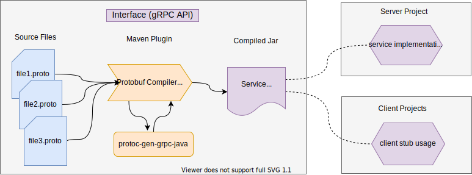

# configrpc-api
The gRPC API for ConfigRPC server

This a [gRpc](https://grpc.io/docs/guides/) interface to integrate with Configrpc gRPC Service



### How do I get set up? ###

Note: this project uses Google protocol buffers:

- protoc compiler, version 3.12 or newer run 
 `brew install protobuf`  
- java 8 or newer 

### To use as a dependency locally run command below
`$./mvnw clean install`

### To download dependency sources locally, run
`./mvnw source:jar install`

### Add as a dependency to other project
``` 
<dependency>
 <groupId>e2log</groupId>
 <artifactId>configrpc-api</artifactId>
 <version>0.1-SNAPSHOT</version>
</dependency>
```
